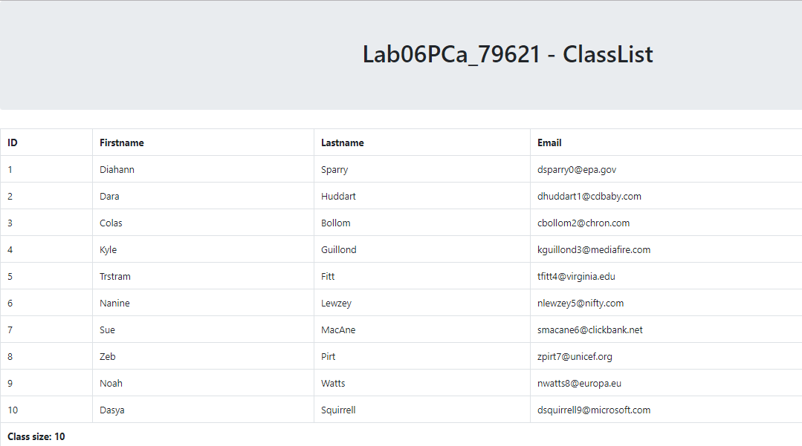

# Lab 06 CSIS 3280 - Functions and Arrays

## Submission Requirements

Please refer to Lab 1 for Submission details including how to properly name and format your zip file and how to use git.  Please remember to do a final commit and not leave any files staging.

Prior to leaving class you must submit your zip file and have the instructor come by and assign a mark.  Failure to submit a zip file prior to leave class will result in a ZERO mark.  Attendance is dependant on your participation in the Lab so please be sure you have submitted and the instructor has come by to assign a mark.

## Lab Assignment

This lab is a one peice Lab.

Using the sample.csv file write a web application that will prompt the user to select the file, you must then upload the file and parse the file into objects in PHP.  The application will then accept the file, parse it display a class list. Including the count at the bottom.

## Lab Requiremnts

> For this lab you may not move any of the file structures and you must adhere to the following structure:

        --Lab06PCa_79621

                |-- inc/
                    |--page.inc.php -- Page Object File
                    |--students.inc.php -- Student Object File
                    |--person.inc.php -- Person Object File
                    |--classroom.inc.php -- Classroom Object File
                    |--studentparser.inc.php - Student Parser utility class
        
                |-- css/
                    style.css
        
                |--Lab06PCa_79621.md - Assignment File
                |--Lab06PCa_79621a.php - File upload Controller file
                |--Lab06PCa_79621alist.php - Class list Controller file
                |--sample.csv - Sample text file

> You may not mix any of the sorting or generation code between the model and the view, all your html functions should be static, you may pass in the data as arrays.  You may also pass in things like the page title to the html function.

For this lab:
* You may not alter the file structure (above)
* You must use object for the Person, Students, StudentParser and classroom
* You may not move any of the files (above)
* Your page object must not contain any decision logic only display logic
* Your code must be documented, objects, functions and attributes as well as any additional decision making logic.
* If there is a problem parsing the file your program must throw an exception. Use badexample.csv

BONUS MARKS - For an extra bonus mark you may pretty up the page using a responsive html framework such as Bootstrap, Foundation 3 etc.  Be sure to provide a linke to the website of the framework you used.

## Your Submission
Please include the code you used to generate the file

## Screenshots

Please include a screenshot in the placeholder below:

Please include a screenshot of your exception firing below:

## References: 

1. [W3C Bootstrap Tutorial](https://www.w3schools.com/bootstrap/default.asp)
2. [Bootstrap Page](https://getbootstrap.com/docs/4.0/getting-started/introduction/)

# STOP! - This is a pre-assignment submission checklist!

* Did you follow the naming convention for your files?!
* Did you follow the naming convention for your folder?!
* Does your application open on a douglas college computer.
* Did you follow the coding and commenting standards?
* ZIP files are the only files that will be accepted, nothing else.
* Double check **before** submitting

#### Evaluation of lab and in class assignments

*A note on Labs* - Please be advised most labs will be marked on a sliding scale as they will vary in terms of the amount of artifacts required for submission as well as the difficulty of the lab.  Typically in class labs are marked as follows unless otherwise specified.

| Mark | Comment |
| --- | --- |
| 1 - Partial | Lab partially complete, minimal understanding and execution and concepts demonstrated items missing or incomplete from submission. |
| 2 - General | Lab mostly complete requirements, minor errors present, full submission. |
| 3 - Full | Lab fully complete, concepts and execution demonstrate mastery.  No errors present in submission. |

 Please be sure to follow the Markdown convention and that your document is formatted properly.  There are a few variations of the Markdown format but I will generally be using VSCode to view your files.
